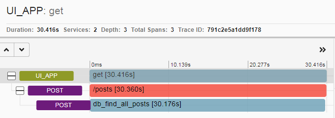

# IsieIam_microservices
IsieIam microservices repository

[](https://travis-ci.com/Otus-DevOps-2020-05/IsieIam_microservices)

<details>
<summary>Домашнее задание к лекции №17 (Docker контейнеры. Docker под капотом)
</summary>

### Предзадание:
>В репозитории должна быть настроена интеграция с travis-ci по аналогии с репозиторием infra.

- Добавлен pre-commit, шаблон pullrequest, переиспользован gitignore с пред заданий.
- Сделана интеграция c travis, настроены уведомления по commit и build-ам в slack.

### Задание:

- Установлен Docker, docker-compose, docker-machine
- Запущен контейнер с Helloworld
- Задание с docker images:
>Для сдачи домашнего задания, необходимо сохранить вывод команды docker images в файл docker-monolith/docker-1.log и закоммитить в репозиторий

Сделано.
- Пробежал по командам которые не встречал еще в работе, а так для памяти шпаргалка по докеру: https://habr.com/ru/company/flant/blog/336654/
- Опробован в работе docker-machine:
```
СОздаем произвольныйх хост в YC:
yc compute instance create \
  --name docker-host \
  --zone ru-central1-a \
  --network-interface subnet-name=default-ru-central1-a,nat-ip-version=ipv4 \
  --create-boot-disk image-folder-id=standard-images,image-family=ubuntu-1804-lts,size=15 \
  --ssh-key ~/.ssh/appuser.pub

Сетапим на уделнную машину все что нужно docker-machine:
docker-machine create \
  --driver generic \
  --generic-ip-address=84.201.175.120 \
  --generic-ssh-user yc-user \
  --generic-ssh-key ~/.ssh/appuser.pub\
  docker-host

Переключаемся на докер демон у удаленного хоста:
eval $(docker-machine env docker-host)
Так вернуться на локальный
eval $(docker-machine env --unset)

Все удалить:
docker-machine rm docker-host
yc compute instance delete docker-host
```
- Создан докер файл и необходимоые файлы для установки monolith
- На основе созданного образа, запущен контейнер в YC, проверена работоспособность.
- Зарегистрировался в https://hub.docker.com запушил туда созданный образ с monolith
- Проверил запуск контейнера с моего образа с hub.docker.com:
```
docker run --name reddit -d -p 9292:9292 isieiam/otus-reddit:1.0
```

### Задание со * №1:
>На основе вывода команд:
```
$ docker inspect <u_container_id>
$ docker inspect <u_image_id>
```
>объясните чем отличается контейнер от образа. Объяснение допишите в файл dockermonolith/docker-1.log

Сделано, пояснение занесено в файл.

### Задание со * №2:

>Теперь, когда есть готовый образ с приложением, можно автоматизировать поднятие нескольких инстансов в Yandex Cloud, установку на них докера и запуск там образа /otus-reddit:1.0

>Нужно реализовать в виде прототипа в директории /docker-monolith/infra/

>Поднятие инстансов с помощью Terraform, их количество задается переменной;

>Несколько плейбуков Ansible с использованием динамического инвентори для установки докера и запуска там образа приложения;

>Шаблон пакера, который делает образ с уже установленным Docker;

В каталоге docker-monolith/infra созданы 3 каталога
 - каталог ansible - содержит в себе:
```
два playbook:
packer_docker.yml - отвечает за создание packer-ом образа с установленным docker и python-docker.
start_dockerc.yml - отвечает за запуск нужного контейнера
слегка доработанный скрипт dynamic inventory
get_inventory.py - который собирает инвентори из YC и группирует хосты по начальному имени инстанса до символа "-".
```
 - каталог packer - содержит в себе:
```
docker.json - описательная часть образа c provisioner packer_docker.yml
variables.json.example - пример переменных
```

 - каталог terraform - содержит в себе:
```
main.tf - упрощенное создание инстансов с требуемым парамтером на кол-во VM
файлы взятые с первого ДЗ по терраформу :)
variables.tf
output.tf
```

Для запуска:
- из каталога infra: packer build -var-file packer/variables.json packer/docker.json
- смотрим id образа: yc compute image list и вставляем ее в terraform.tvars
- в каталоге infra/terrafrom: terraform apply
- и из каталога infra/ansible: ansible-playbook ./playbooks/start_dockerc.yml

</details>


<details>
<summary>Домашнее задание к лекции №18 (Docker образы. Микросервисы)
</summary>

### Задание:

 - Разбит Monolith на 3 микросервиса в Docker
 - docker файлы прогнаны через web lint-сервис: https://hadolint.github.io/hadolint/ что увидел поправил, за исключением версий пакетов у apt :)
 - Сервисы запущены на YC через docker-machine и проверена работоспособность
 - Оптимизированы(удалены лишние команды, схлопнуты часть слоев, подчищены временные файлы, кешы, удалены ненужные пакеты) образы на базе предложенных начальных образов (за исключением post - там вроде уже особо некуда)
 - к mongo подключен volume, проверено сохранение данных при рестарте контейнера.

### Задание со * №1:

>Запустите контейнеры с другими сетевыми алиасами

>Адреса для взаимодействия контейнеров задаются через ENV - переменные внутри Dockerfile 'ов

>При запуске контейнеров ( docker run ) задайте им переменные окружения соответствующие новым сетевым алиасам, не пересоздавая образ

>Проверьте работоспособность сервиса

Контейнеры запустить можно так:
```
docker run -d --network=reddit --network-alias=post_db_n --network-alias=comment_db_n mongo:latest
docker run -d --network=reddit --network-alias=post_n --env POST_DATABASE_HOST=post_db_n isieiam/post:1.0
docker run -d --network=reddit --network-alias=comment_n --env COMMENT_DATABASE_HOST=comment_db_n isieiam/comment:1.0
docker run -d --network=reddit -p 9292:9292 --env COMMENT_SERVICE_HOST=comment_n --env POST_SERVICE_HOST=post_n isieiam/ui:1.0
```

т.е. поменялись alias и переопределились env переменные на новые alias

### Задание со * №2:

>Попробуйте собрать образ на основе Alpine Linux
>Придумайте еще способы уменьшить размер образа
>Можете реализовать как только для UI сервиса, так и для остальных ( post , comment )
>Все оптимизации проводите в Dockerfile сервиса. Дополнительные варианты решения уменьшения размера образов можете оформить в виде файла Dockerfile.<цифра> в папке сервиса

ui и comment переведены на ruby-alpine образ (не самый актуальный, т.к. версия bundle нужна старая по requirements) и дополнительно часть слоев схлопнута.

Общий принцип - все что добавляет "байты" в слое, желательно в этом же слое и подчищать :)

Созданы Dockerfile.1 для ui и comment и результат примерно следующий:
- версии 1.0/2.0 - это оптимизация на базе дефолтного начального образа
- версии 1.0u/2.0u - это образ alpine + оптимизация по слоям с очисткой

```
REPOSITORY          TAG                 IMAGE ID            CREATED              SIZE
isieiam/comment     1.0u                0076875e1a3b        4 seconds ago        70.4MB
isieiam/comment     1.0                 8b2ed232ac1b        About a minute ago   737MB
isieiam/ui          2.0u                0c3d3cc120f8        23 minutes ago       72.5MB
isieiam/ui          2.0                 f4ebe5fe7d37        24 minutes ago       199MB
isieiam/ui          1.0                 60566ef44aef        2 hours ago          760MB
isieiam/post        1.0                 26eea89db2fd        2 hours ago          110MB
```

- проверено что приложение после манипуляций все еще работает.
- для билда использовать(для памяти):

```
docker build -t isieiam/post:1.0 ./post-py
docker build -t isieiam/comment:1.0u ./comment
docker build -t isieiam/ui:2.0u ./ui
```

- для запуска использовать:

```
docker run -d --network=reddit --network-alias=post_db --network-alias=comment_db mongo:latest
docker run -d --network=reddit --network-alias=post isieiam/post:1.0
docker run -d --network=reddit --network-alias=comment isieiam/comment:1.0u
docker run -d --network=reddit -p 9292:9292 isieiam/ui:2.0u
```

</details>

<details>
<summary>Домашнее задание к лекции №19 (Сетевое взаимодействие Docker контейнеров. Docker Compose. Тестирование образов)
</summary>

### Задание:

- Изучена работа сетей докера (none, host, bridge):

<details>
<summary>Мини-задания
</summary>

>Запустите несколько раз (2-4) docker run --network host -d nginx
>Каков результат? Что выдал docker ps? Как думаете почему?

Результат: запущен всего 1 контейнер, т.к.(надо просто посмотреть в логи, остановленных контейнеров nginx :)):
```
nginx: [emerg] bind() to 0.0.0.0:80 failed (98: Address already in use)
2020/08/09 18:26:29 [emerg] 1#1: bind() to [::]:80 failed (98: Address already in use)
```

>Повторите запуски контейнеров с использованием драйверов none и host и посмотрите, как меняется список namespace-ов.

Основное отличие, что на none - на каждый запуск контейнера генериртся новый namespace.
</details>

- Создана сеть типа bridge и запущены в ней наши контейнеры.

```
docker run -d --network=reddit --network-alias=post_db --network-alias=comment_db mongo:latest
docker run -d --network=reddit --network-alias=post isieiam/post:1.0
docker run -d --network=reddit --network-alias=comment  isieiam/comment:1.0
docker run -d --network=reddit -p 9292:9292 isieiam/ui:1.0
```

- Проверена работа alias и реализован запуск контейнров в разных сетях

```
docker run -d --network=front_net -p 9292:9292 --name ui  isieiam/ui:1.0
docker run -d --network=back_net --name comment  isieiam/comment:1.0
docker run -d --network=back_net --name post  isieiam/post:1.0
docker run -d --network=back_net --name mongo_db --network-alias=post_db --network-alias=comment_db mongo:latest
docker network connect front_net post
docker network connect front_net comment
```

- Изучено что происходит с сетевым стеком ОС при создании и использовании сетей docker.
- Docker-compose: проверена работоспособность compose файла для нашего сервиса.
- Добавлено и проверено использование env переменных.
- Изменен docker-compose под кейс с множеством сетей, сетевых алиасов.
- Параметризован docker-compose через .env файл (порт публикации сервиса ui, версии сервисов) - в репо добавлен файл шаблона для .env. Проверена работоспособность.
- В переменные окружения добавлено переназначение имени проекта:

>Узнайте как образуется базовое имя проекта. Можно ли его задать? Если можно то как?

Инфо об имени проекта есть тут:
https://docs.docker.com/compose/reference/envvars/#compose_project_name
и тут:
https://docs.docker.com/compose/reference/overview/
Если кратко, то проект именуется по имени каталога, но можно переопеределить или через -p ключ или через переменную окружения:
```
Each configuration has a project name. If you supply a -p flag, you can specify a project name. If you don’t specify the flag, Compose uses the current directory name
```

### Задание со *:

>Создайте docker-compose.override.yml для reddit проекта, который позволит

Создан файл docker-compose.override.yml, который вызывается автоматом при вызове docker-compose up.
Можно его переименовать и вызывать через ключ -f. Вкачестве подсказки воспользоваться можно статьей OTUS https://habr.com/ru/company/otus/blog/337688/

>Изменять код каждого из приложений, не выполняя сборку образа

Реализовано через вариант монтирования локального каталога с исходниками. Но в текущем примере(с удаленным docker host) - это просто так работать не будет - надо либо docker-compose запускать локально, либо переносить исходники на удаленный host.

>Запускать puma для руби приложений в дебаг режиме с двумя воркерами (флаги --debug и -w 2)

Добавлено через command внутри override.

</details>

<details>
<summary>Домашнее задание к лекции №21 (Устройство Gitlab CI. Построение процесса непрерывной интеграции)
</summary>

### Задание:

- Развернута vm(через соседний packer c docker-ом и terraform).
- Используя docker-compose.yml развернут gitlab
- В gitlab проведены базовые настройки, создана группа и проект.
- Добавлен remote с проектом на gitlab к локальному репо.
- Создан .gitlab-ci.yml
- Добавлен и настроен runner
- Проверена работа pipeline-ов gitlab-а.
- Добавлены окружения, проверена работа пайплайнов с окружениями. Изучены и опробованы дианмические окружения.
- Опробована работа с тегами.

</details>


<details>
<summary>Домашнее задание к лекции №23 (Введение в мониторинг. Модели и принципы работы систем мониторинга)
</summary>

### Задание:

- Запущен Prometheus в докере на удаленной машине, изучены базовые возможности web-интерфейса.
- Изменена структура каталогов в репо, созданы докер файл, файл конфигурации и образ Prometheus.
- Сбилжены старые микросервисы, модифицирован docker-compose и добавлен в него prometheus.
- Проверена работоспособность сервисов и мониторинг их в prometheus.
- Изучена работа healthcheck-ов.
- Добавлен Node exporter в docker-compose и настройка на его мониторинг в prometheus, изучен мониторинг хоста.

<details>
<summary>Вспомогательные команды</summary>

```
yc compute instance create \
  --name docker-host \
  --zone ru-central1-a \
  --network-interface subnet-name=default-ru-central1-a,nat-ip-version=ipv4 \
  --create-boot-disk image-folder-id=standard-images,image-family=ubuntu-1804-lts,size=15 \
  --ssh-key ~/.ssh/appuser.pub

docker-machine create \
  --driver generic \
  --generic-ip-address=84.201.128.170 \
  --generic-ssh-user yc-user \
  --generic-ssh-key ~/.ssh/appuser \
  docker-host

eval $(docker-machine env docker-host)

docker-machine rm docker-host
yc compute instance delete docker-host

```
</details>

### Задание со * №1:

>Добавьте в Prometheus мониторинг MongoDB с использованием необходимого экспортера.

- Найдено и изучено: https://github.com/percona/mongodb_exporter
- Взят из перконы dockerfile, модифицирован под скачивание исходников mongodb_exporter и создан ./monitoring/mongodb_exporter/Dockerfile
- Образ mongodb_exporter собран свой и закинут на докерхаб https://hub.docker.com/repository/docker/isieiam/mongodb_exporter
- Добавлены настройки с mongodb_exporter в конфиг prometheus и доп сервис в docker-compose.yml.
- Проверена работоспособность - все ок - target появился, метрики есть.

### Задание со * №2:

>Добавьте в Prometheus мониторинг сервисов comment, post, ui с помощью Blackbox exporter

- взят образ с последней версией blackbox отсюда: https://hub.docker.com/r/prom/blackbox-exporter/tags
- изучено https://github.com/prometheus/blackbox_exporter/blob/master/README.md
- написаны ./monitoring/blackbox_exporter/dockerfile, blackbox.yml и собран образ blackbox и отправлен на докерхаб
- в конфиг prometheus добавлены два job-a: проверка по http ui и проверка портов tcp остальных сервисов
- проверена работоспособность: наличие таргетов, наличие метрик и их корректное поведение на состояние сервисов

>Для памяти: статус target blackbox не отображает статус метрики https://github.com/prometheus/blackbox_exporter/issues/79

### Задание со * №3:

>Задание: Напишите Makefile , который в минимальном варианте умеет:
>- Билдить любой или все образы, которые сейчас используются
>- Умеет пушить их в докер хаб

- Нагуглено и изучено: https://ealebed.github.io/posts/2017/использование-make-для-управления-docker-контейнерами/
- Создан Makefile, который умеет билдить и пушить образы (вход на докер хаб надо делать отдельно :) )
- Применение:

```
make или make help выдают список возможных билдов и пушей
make all билдит все
make pushall пушит все
```

</details>

<details>
<summary>Домашнее задание к лекции №24 (Мониторинг приложения и инфраструктуры)
</summary>

### Задание:

- Разделен docker-compose.yml на docker-compose.yml и docker-compose-monitoring.yml
- Добавлен в compose и запущен cAdvisor в сервисы докера и в настройки prometheus. Изучено его GUI.
- Добавлена в compose и настроена на prometheus grafana.
- Скачан и импортирован в grafana дашборд "docker and system monitoring".(добавлен в каталог с дашбордами grafana DockerMonitoring.json)
- Создан дашборд UI_Service_Monitoring и в него добавлены графики по метрикам приложения:

```
Графики:
- Rate of UI request count ("rate(ui_request_count[1m])")
- Rate of UI requests count with error ("rate(ui_request_count{http_status=~\"^[45].*\"}[1m])")
- HTTP responce time of 95% ("histogram_quantile(0.95, sum(rate(ui_request_response_time_bucket[5m])) by(le))")
файл дашборда в директории monitoring/grafana/dashboards с названием UI_Service_Monitoring.json
```

- Создан дашборд Business_Logic_Monitoring с графиками:

```
- Posts Rate ("rate(post_count[1h])")
- Comments Rate ("rate(comment_count[1h])")
!!! Внимание, метрики может не быть, если она ни разу не возникла, т.е. она даже в списке прометея выпадать не будет.
```

- Создан, настроен и запущен Alertmanager(создан конфиг с уведомлениями в slack, настроен prometheus(конфиг + добавлен alerts.yml))
- Проверена работа alert в свой канал в slack-е (для настройки использована инструкция https://rtfm.co.ua/nagios-nastrojka-uvedomlenij-v-slack-chat/)
- Запушены образы на докерхаб (у alertmanager хук закрашен fake данными)
- ссылка на докерхаб с образами: https://hub.docker.com/u/isieiam

### Задание со *:

>Если в прошлом ДЗ вы реализовали Makefile, добавьте в него билд и публикацию добавленных в этом ДЗ сервисов;

- добавлен alermanager, grafana(с ней конечно спорно, по идее дашборды надо хранить в гите и при старте контейнера подключать их как configmap) на build, push
- добавлен функционал запуска и остановки сервиса и мониторинга

>В Docker в экспериментальном режиме реализована отдача метрик в формате Prometheus. Добавьте сбор этих метрик в Prometheus. Сравните количество метрик с Cadvisor. Выберите готовый дашборд или создайте свой для этого источника данных. Выгрузите его в monitoring/grafana/dashboards;

- Изучено: https://docs.docker.com/config/daemon/prometheus/ добавлено на докер хосте настройка в daemon.json(правда вместо localhost указан 0.0.0.0).
- Добавлена настройка в prometheus по внешнему ip(не очень хорошо, но не вижу применения на практике такой комбинации когда есть cadvisor).
- На глаз метрик меньше чем у cadvisor.
- Добавлен общедоступный дашборд - docker_engine_metrics.

>Для сбора метрик с Docker демона также можно использовать Telegraf от InfluxDB. Добавьте сбор этих метрик в Prometheus. Сравните количество метрик с Cadvisor. Выберите готовый дашборд или создайте свой для этого источника данных. Выгрузите его в monitoring/grafana/dashboards;

- Изучено: https://hub.docker.com/_/telegraf и https://github.com/influxdata/telegraf/tree/master/plugins/outputs/prometheus_client
- Создан докер-файл, простейший конфиг для telegraf с использованием плагина для докера.
- сбилжен и запушен образ telegraf, добавлен в make, добавлен конфиг в prometheus и docker-compose-monitoring
- собрана простенькая витринка telegraf для grafana(uptime и загрузка cpu контейнерами).

>Придумайте и реализуйте другие алерты, например на 95 процентиль времени ответа UI, который рассмотрен выше; Настройте интеграцию Alertmanager с e-mail помимо слака;

- алерт на 95 процентиль сделан, добавил фейковое значение для проверки срабатывания.
- по интеграции с e-mail только посмотрел примеры: https://prometheus.io/docs/alerting/latest/configuration/ - в принципе все просто, но как сделать это более менее безопасно, без явного указания логина пока непонятно.

### Задание с **:

>В Grafana 5.0 была добавлена возможность описать в конфигурационных файлах источники данных и дашборды. Реализуйте автоматическое добавление источника данных и созданных в данном ДЗ дашбордов вграфану;

- изучено https://ops.tips/blog/initialize-grafana-with-preconfigured-dashboards/ и https://superuser.com/questions/1477291/grafana-provisioning-dashboards-in-docker
- создан каталог ./monitoring/grafana/provisioning в нем каталог для datasources и каталог dashboards, где согласно инструкицям из статей добавлены необходимые настройки.
```
Есть какой то глюк с ненахождение datasource, причем при втором пересохранении дашбордов не случился, непонятно, гуглится, говорят исправлено в новых версиях.
```

>Реализуйте сбор метрик со Stackdriver, в PR опишите, какие метрики удалось собрать;

- не делал: принцип понятен, добавлять еще один доп источник метрик уже не интересно :)

>Придумайте свои метрики приложения/бизнес метрики и реализуйте их в коде приложения. Опишите в PR что было добавлено;

- не делал: изучил код, посмотрел как создаются метрики

### Задание с ***:

- не делал


</details>

<details>
<summary>Домашнее задание к лекции №26 (Применение системы логирования в инфраструктуре на основе Docker)
</summary>

### Задание:

- Пересобраны приложения с тегом logging.
- Создан docker/docker-compose-logging.yml для EFK.
- Создан Dockerfile, конфиг для fluentd, сбилжен и отправлен на dockerhub, а также добавлен в logging файл.
- Проверен запуск на 2GB RAM, на старте Kiban-ы хост "наглухо" умер с потерей ssh :)
- Добавлена настройка для post и ui  для отправки логов в fluentd
- Kibana: созданы index-pattern для индекса из потока fluentd, изучены логи приложения.
- Добавлен фильтр по json, добавлен фильтр с парсером по явной регулярке в fluentd.
- Изучены и добавлены описанные grok шаблоны в конфиг fluentd(распарсены часть полей логов сервиса ui).
- Добавлен в docker-compose-logging zipkin - изучены возможности трассировки запросов.

### Задание со * №1:

>Составьте конфигурацию Fluentd так, чтобы разбирались оба формата логов UI-сервиса (тот, что сделали до этого, и текущий) одновременно.

- Изучены варианты grok-шаблонов здесь: https://github.com/hpcugent/logstash-patterns/blob/master/files/grok-patterns)
- добавлен доп фильтр для парсинга оставшегося варианта нераспарсенных логов в конфиг fluentd.
- Отдельный "+" полю method, который по сути является WORD, но при этом пробел переводит его GREEDY :)

```
method= POST
```

### Задание со * №2:

>Траблшутинг UI-экспириенса
>Код приложения с багом(https://github.com/Artemmkin/bugged-code) отличается от используемого ранее в этом ДЗ и доступен со сломанным кодом приложения. Т.е. необходимо сбилдить багнутую версию приложения и запустить Zipkin для неё.

- добавлено src_bugged для забагованного приложения
- отредактированы dockerfile(добавлены env переменные) и ./docker_build.sh(подправлено имя пользователя + добавлен тег bugged - чтобы не портить основное приложение)
- добавлен run-log, stop-log команды в makefile
- Заменена logged версия приложения на bugged в env. Сбилжено и запущено приложение.

Проблема: глядя на трейс, видно что обращение к post сервису, выполнялось 30сек - и собственно было 2 проблемы:

- post-py/post_app.py - поиск по find_post вывел на метод def find_post(id) - стояла явная задержка в 3 сек (time.sleep(3))
- Проблема два, увы, я не осилил понять в чем дело: проблемное приложение фейлится по таймауту в 30 сек с 500 ошибкой, если в бд нет ни одного поста. После того как запустил нормальное приложение, создал пост, то и проблемное нормально загрузилось с заложенной задержкой в 3сек. Закоментив задержку - все стало работать как обычно.



</details>

<details>
<summary>Домашнее задание к лекции №28 (Введение в Kubernetes)
</summary>

### Задание:

> Пройти YC Kubernetes The Hard Way;

- Выполнено (url The Hard Way https://gitlab.com/AlPervakov/yc-kubernetes-the-hart-way/-/tree/master).

> Проверить, что kubectl apply -f <filename> проходит по созданным до этого eployment-ам (ui, post, mongo, comment) и поды запускаются;

- Добавлены "наброски" deployment-ов для сервисов reddit, проверено, pod-ы запускаются:

```
isie@isie-VirtualBox:~/otus/IsieIam_microservices/kubernetes/reddit(kubernetes-1)$ kubectl get pods
NAME                                 READY   STATUS    RESTARTS   AGE
busybox                              1/1     Running   0          21m
comment-deployment-7dd7bb55d-4ns6l   1/1     Running   0          61s
mongo-deployment-86d49445c4-vg5gb    1/1     Running   0          3m51s
nginx-554b9c67f9-qnkth               1/1     Running   0          17m
post-deployment-74f87495b4-b9fbz     1/1     Running   0          101s
ui-deployment-69c87bd688-hcgld       1/1     Running   0          55s
```

### Задание c *:

>Описать установку компонентов Kubernetes из THW в виде Ansibleплейбуков в папке kubernetes/ansible; Задание достаточно выполнить в виде Proof of Concept, просто автоматизация некоторых действий туториала.

- Для примера создан playbook kubernetes/ansible/install_workers.yml для установки бинарников worker нод, но это больше Proof of Concept (не имеет смысла автоматизировать то, что уже сделано :) ).
- Аналогично можно создать playbook и для мастер нод, и под разные этапы: копирование сертификатов, конфигов, настройка  и пр.
- Дополнительно рассмотрены внешние варианты playbook-ов ansible:

```
- Вариант от Geerling:
https://github.com/geerlingguy/ansible-role-kubernetes
- Вариант от k8s:
https://kubernetes.io/blog/2019/03/15/kubernetes-setup-using-ansible-and-vagrant/
```

</details>

<details>
<summary>Домашнее задание к лекции №29 (Основные модели безопасности и контроллеры в Kubernetes)
</summary>

### Задание:

- Установлен и запущен minicube, в качестве provisioner использован docker: https://kubernetes.io/docs/tasks/tools/install-minikube/)

```
sudo -E minikube start --driver=none
```

- Дописаны deployment, service и dev-namespace для reddit
- ознакомился с port-forwarding (для памяти команды)

```
$ kubectl get pods --selector component=ui
$ kubectl port-forward <pod-name> 8080:9292
```

- Reddit развернут в minicube
- Ознакомился на примерах с minicube dashboard (увы для provisioner docker, dashboard плагин пока нерабочий)
- Создан кластер k8s в yandex облаке, в нем развернуто приложение reddit и проверена работоспособность приложения.

```
kubectl get nodes -o wide
NAME                        STATUS   ROLES    AGE     VERSION   INTERNAL-IP   EXTERNAL-IP       OS-IMAGE             KERNEL-VERSION     CONTAINER-RUNTIME
cl11amvft55754cj2e5a-ukec   Ready    <none>   9m4s    v1.17.8   10.130.0.12   178.154.227.240   Ubuntu 18.04.4 LTS   5.4.0-47-generic   docker://18.6.2
cl11amvft55754cj2e5a-ydir   Ready    <none>   9m14s   v1.17.8   10.130.0.29   178.154.225.223   Ubuntu 18.04.4 LTS   5.4.0-47-generic   docker://18.6.2
```

</details>

<details>
<summary>Домашнее задание к лекции №30 (Ingress-контроллеры и сервисы в Kubernetes)
</summary>

### Задание:

- Задания выполнялись в YC (PVC, PV, SC несколько отличаются, как и подход к ingress controller)
- Рассмотрено сетевое взаимодействие компонентов в кластере.
- Создан LoadBalancer (https://cloud.yandex.ru/docs/managed-kubernetes/operations/create-load-balancer)
- Задеплоен ingress controller:

```
вспомогательные статьи:
- https://kubernetes.github.io/ingress-nginx/deploy/
- https://medium.com/@arturgspb/yandex-cloud-kubernates-with-ingress-loadbalancer-without-ssl-7d358f412daf
- kubectl apply -f https://raw.githubusercontent.com/kubernetes/ingress-nginx/controller-v0.35.0/deploy/static/provider/cloud/deploy.yaml
по статье медиума: версия устарела, но принцип понятен
ингресс с гитхаба - не все взлетает идеально, но основной под запускается и работает как предполагается
```

- Создан ingress проверена работоспособность.
- Добавлен свой сертификат к ingress, правда у того ингресса, что пришел с гитхаба по дефолту есть fake k8s сертификат :)
- Изучена работа network policy(главное не забыть правильно создать кластер - поставить нужную галочку) (https://cloud.yandex.ru/docs/managed-kubernetes/operations/running-network-policy)
- Подправлен mongo-network-policy.yml так, чтобы post-сервис дошел до базы данных.
- Изучена организация хранилищ в кластере (Volume, PV, PVC, SC):

```
Динамическое выделение:
https://cloud.yandex.ru/docs/managed-kubernetes/operations/volumes/dynamic-create-pv
Статическое:
https://cloud.yandex.ru/docs/managed-kubernetes/operations/volumes/static-create-pv
Классы:
https://cloud.yandex.ru/docs/managed-kubernetes/operations/volumes/manage-storage-class
!!! k8s не следит в данном случае, что создается первым при вызове "задеплой весь каталог": и если pvc создастся раньше storage class, то работать не будет и pvc надо пересоздать еще раз.
```

- Вспомогательные команды, чтобы не искать:

```
пересоздание контекста:
yc managed-kubernetes cluster get-credentials otus-cluster --external --force
деплой всего:
kubectl apply -f ./kubernetes/reddit
```

### Задание *:

 - Создан ui-ingress-secret.yml по инфо по ccылке с https://kubernetes.io/docs/concepts/services-networking/ingress/

</details>

<details>
<summary>Домашнее задание к лекции №31 (Интеграция Kubernetes в GitlabCI)
</summary>

### Задание:

 - Установлен Helm2 + Tiller, Helm3
 - Созданы chart-ы и template отдельных приложений.
 - Разобрана подстановка переменных в template.
 - Изучена работа зависимостей на примере приложения reddit (./kubernetes/Charts/reddit)
 - Установлен последний gitlab в YC кластер :),
 - Создана группа, проекты наших сервисов.
 - Настроен ci для каждого приложения - под новую версию не забыть - чтобы runner вообще запустился нужно использовать image docker dind - иначе будет ошибка подключения к docker daemon.

```
На будущее/на память:
Установка gitlab с отключенным tls:
helm install gitlab . \
  --set global.ingress.tls.enabled=false \
  --set global.hosts.https=false \
  --set certmanager-issuer.email=qq@yandex.ru

Далее проверяем что все запустилось и получаем адрес ingress:
kubectl get ingress
kubectl get pods

После чего запускаем реконфигуре,более красивое решение надо погуглить, но на имя домена в новом завязано почти все в том числе runner:
helm upgrade gitlab . \
  --set global.hosts.domain=84.201.181.199.xip.io \
  --set global.ingress.tls.enabled=false \
  --set global.hosts.https=false \
  --set certmanager-issuer.email=qq@yandex.ru

чтобы получить пароль root:
kubectl get secret gitlab-gitlab-initial-root-password -ojsonpath='{.data.password}' | base64 --decode ; echo
```

 - увы нормальной работы gitlab runner так и не удалось победить - он то запускается, то нет, то может скачать docker-dind то нет(kubernetes/Charts/gitlab2 - последний на текущий момент helm пакет gitlab подправленный под http).
 - В результате был развернут k8s в GCE, установлен gitlab-omnibus и все pipeline приложений уже запускались там.
 - Переписаны pipeline без autodevops(на последнем gitlab - они не запускаются :()
 - Реализован разный деплой приложений: helm2, helm3, helm2plugin
 - Для памяти:

```
Собранные зависимости helm2 и helm3 несовместимы друг с другом, чтобы пересобрать зависимости (на нашем примере):
helm dep update ./reddit
```

### Задание со *:

>Сейчас у нас выкатка на staging и production - по нажатию кнопки. Свяжите пайплайны сборки образов и пайплайн деплоя на staging и production так, чтобы после релиза образа из ветки мастер запускался деплой уже новой версии приложения на production

- Изучено: https://docs.gitlab.com/ee/ci/triggers/
- создан триггер для репа reddit-deploy
- создана доп переменная окружения DEPLOY_TOKEN для своей группы gitlab
- Добавлен вызов триггера/хук/не хук в pipeline с костыликом в виде "узнай адрес гитлаба" через /etc/hosts:

```
  after_script:
    - apk add -U curl
    - echo "%GITLAB_IP gitlab-gitlab" >> /etc/hosts
    - "curl -X POST -F token=$DEPLOY_TOKEN -F ref=master http://gitlab-gitlab/api/v4/projects/1/trigger/pipeline"
```

- Описание параметров curl есть по ссылке выше, допом сам адрес триггера будет указан на страничке его создания в настройках ci/cd нужного репа, для нашего примера: http://gitlab-gitlab/isieiam/reddit-deploy/settings/ci_cd

</details>
